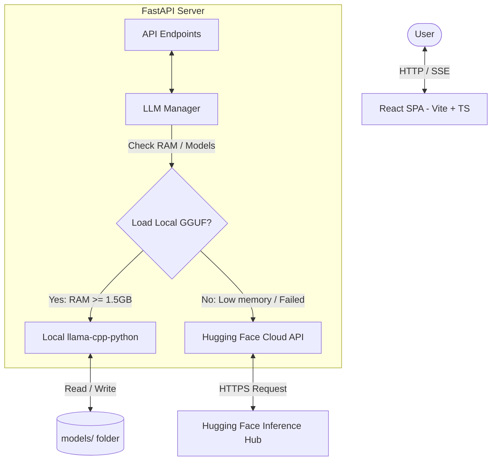

# Antigravity AI Coding Assistant ⚡

A production-ready, resource-optimized, containerized AI Coding Assistant using **Qwen2.5-Coder-0.5B-Instruct** as its core engine. Built with a Python FastAPI backend and a stunning dark-theme React + Vite + TypeScript frontend.



---

## 🌟 Key Features

* **Cascading Fallback Pipeline:** Automatically runs local Qwen GGUF inference. If RAM is constrained (e.g. Render Free, Railway Starter), it transparently falls back to Hugging Face serverless API.
* **Interactive Code Playground:** Features Monaco Editor (VS Code core) with language syntax highlight selectors and quick AI commands (`Explain`, `Find Bugs`, `Refactor`, `Generate Tests`, `Summarize`).
* **Advanced Chat Window:** Smooth response streaming (Server-Sent Events), code block copy buttons, and drag-and-drop file imports.
* **Production Deployment Ready:** Pre-configured Dockerfiles, Docker Compose, Railway config, and Render deployment specifications.
* **Performance Telemetry:** Live dashboards displaying generation speed (tokens/sec), latency, request tallies, and RAM footprint.

---

## 🛠️ Tech Stack

* **Frontend:** React 19, Vite, TypeScript, Tailwind CSS, Monaco Editor, Lucide Icons, Framer Motion
* **Backend:** FastAPI, Python 3.11+, Uvicorn, llama-cpp-python, Hugging Face Hub Client, Psutil

---

## 🚀 Quick Start (Local Setup)

### Prerequisites
* Python 3.11+
* Node.js 20+

### Step 1: Clone and Setup Workspace
Clone this repository and navigate to the project directory:
```bash
git clone https://github.com/your-repo/antigravity-coder.git
cd antigravity-coder
```

### Step 2: Install and Download GGUF Model
Use our automated installer script:
```bash
# On Linux/macOS
chmod +x scripts/setup.sh
./scripts/setup.sh

# On Windows (PowerShell)
pip install -r backend/requirements.txt
cd frontend; npm install; npm run build; cd ..
python scripts/download_model.py
```

### Step 3: Run the Application
Start the backend server:
```bash
# Run backend (activates virtual env if created)
python backend/run.py
```
This runs the API server on `http://localhost:8000` and automatically compiles & hosts the React frontend assets. Navigate to [http://localhost:8000](http://localhost:8000) to view the application!

For hot-reloading frontend development:
```bash
cd frontend
npm run dev
```
Open [http://localhost:5173](http://localhost:5173) in your browser.

---

## 🐳 Running with Docker

Run both services in hot-reloading development mode using Docker Compose:
```bash
docker compose -f docker/docker-compose.yml up --build
```
Build and run the production-ready unified container (hosting both frontend and API on port 8000):
```bash
docker build -t antigravity-coder .
docker run -p 8000:8000 antigravity-coder
```

---

## 🌐 Cloud Deployment

Detailed step-by-step guides for deployment configurations:
* [Railway Deployment Guide](docs/DEPLOYMENT.md#railway)
* [Render Deployment Guide](docs/DEPLOYMENT.md#render)
* [API Reference Documentation](docs/API.md)

---

## 🔒 Security

* Standard CORS origin protections.
* Secure in-memory sliding rate limiter per client IP.
* Configuration parsing using Pydantic Settings from `.env` files. Secrets are never hardcoded.
